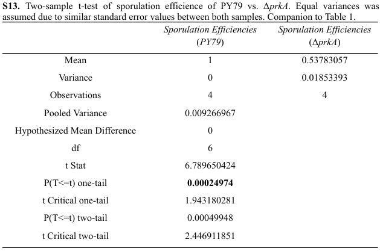
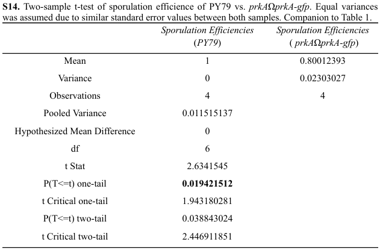

# 📈 Bacterial Sporulation T-Test Analysis
An R script for performing two-sample t-tests to compare sporulation efficiency between wild-type and mutant *Bacillus subtilis* strains.
  

## R Script
Please view the R script 🔗[here](t-test.R).
- *Data can be viewed [here](sporulation_data.csv)*
  

## Context
Bacteria, fungi, and protists form resilient, metabolically dormant spores. Pathogenic bacteria like *Clostridioides difficile* produce antimicrobial-resistant spores, posing clinical challenges. My honors thesis investigated protein roles in bacterial sporulation by comparing the wild-type strain PY79, a reference strain of *Bacillus subtilis* (a model organism for studying sporulation), to three mutant strains, notably the Δ*prkA* mutant which lacks the PrkA protein involved in sporulation. Using R and Welch’s t-test, we analyzed sporulation efficiency, defined as the ratio of cells that successfully form spores, with a value of 1.0 indicating optimal spore formation. The results provided valuable insights into how specific genetic modifications affect sporulation efficiency, contributing to our understanding of bacterial resistance mechanisms and informing strategies to combat antimicrobial-resistant spores in clinical environments.

Word Count: 122 words
  

## Results and Analysis
For the comparison between wild-type and Δ*prkA*, the t-test yielded a significant result (t = 6.7897, df = 3, p-value = 0.006531), indicating that the difference in means is statistically significant, with the wild-type showing a higher mean sporulation efficiency (1.000) compared to the Δ*prkA* strain (0.5378). In the comparison of wild-type versus prkAΩprkA-gfp, the p-value was 0.07805, suggesting a marginally significant difference, with the wild-type strain again showing a higher mean (1.000) compared to the *prkAΩprkA-gfp* strain (0.8001). Finally, the comparison between wild-type and *glt::prkA, prkAΩprkA-gfp* returned a p-value of 0.8954, indicating no significant difference in means, as both strains had similar mean values (1.000 vs. 1.0355). The significant result between wild-type and Δ*prkA* mutant (deletion of prkA gene) suggests that the prkA gene plays an important role in sporulation efficiency, as the Δ*prkA* strain exhibited much lower sporulation efficiency compared to the wild-type. Welch’s t-test was chosen to test whether the means of the two strains/groups are equal or not, as well as its ability to handle unequal variances between groups. The limitations of this statistical analysis include the small sample size, potential experimental errors, and the assumption that the data is normally distributed.

Word Count: 196 words
  

## Two-sample T-test Tables

  

## R Output

  

## Additional Information
For more context and/or information about my honors thesis, please view my [manuscript](Thesis_DarleneCheongSzeWei.pdf).
  

## Language Used
- **R**
